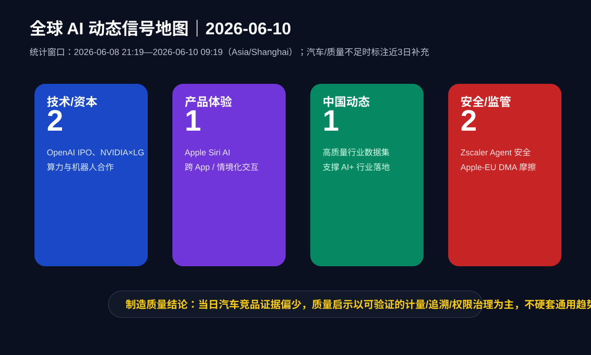
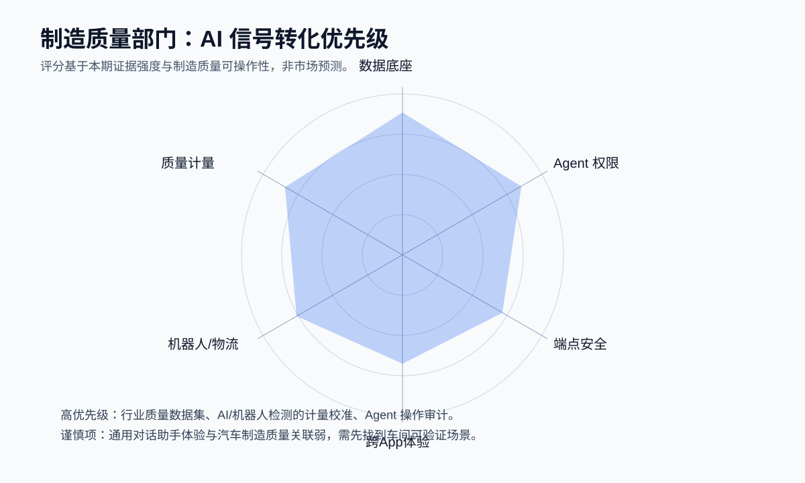
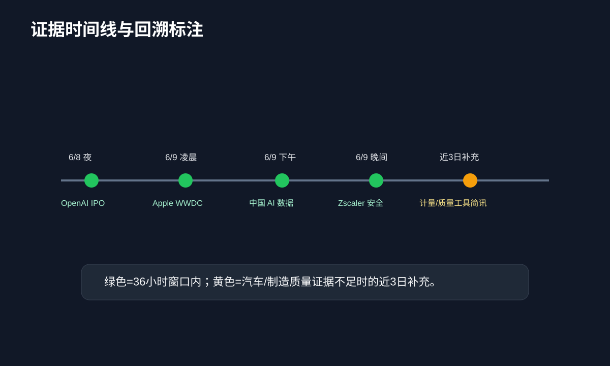

# 全球 AI 每日动态报告｜制造质量部门专用版

- **报告日期**：2026-06-10
- **生成时间**：2026-06-10 09:19（Asia/Shanghai）
- **通用 AI 统计窗口**：2026-06-08 21:19—2026-06-10 09:19（Asia/Shanghai，过去 36 小时）
- **汽车行业、竞品技术信号与制造质量统计窗口**：优先同上；证据不足时最多回溯至 2026-06-07 09:19（Asia/Shanghai），并在条目中标注“近 3 日补充”。
- **AGENTS.md 状态**：仓库内未发现 `AGENTS.md`；已按用户要求的硬性栏目、联网检索、去重、图片嵌入与“不硬套制造质量”的原则执行。
- **历史日报去重**：仓库内未发现历史日报；未能读取最近 3 期，故本期无仓库内历史去重基线。
- **纳入信息数量**：7 条；其中 36 小时窗口内 6 条，近 3 日补充 1 条。
- **图片数量**：3 张 SVG 信息图，均已嵌入正文。

---

## 信息图 1：全球 AI 动态信号地图

## 信息图 2：制造质量部门转化优先级

## 信息图 3：证据时间线与回溯标注

---

## 一、今日结论（给制造质量部门）

1. **今天的强信号不是“又一个更会聊天的模型”，而是 AI 产业进入资本化、企业级治理和行业数据化三条主线并行。** OpenAI/Anthropic IPO 相关进展说明模型公司继续为算力、产品和企业部署融资；这会使汽车企业面对更成熟但也更昂贵的 AI 供应链。
2. **制造质量最值得跟进的是“数据资产化 + Agent 权限治理 + 计量/检测自动化”。** 中国行业数据集建设、Zscaler 对 Agentic AI 的访问图谱和 MCP/A2A 代理安全、以及近 3 日的计量/机器人检测工具信号，均比通用对话体验更贴近质量业务。
3. **当日汽车 OEM/竞品直接证据偏少。** 本期未发现足够新的整车厂 AI 质量或产线 AI 部署新闻；因此汽车行业部分仅保留 NVIDIA×LG 机器人/数据中心合作及近 3 日制造质量工具信号，不把 Apple Siri、OpenAI IPO 等通用 AI 新闻强行解释为车间质量改善。

---

## 二、全球 AI 技术更新

### 1. OpenAI 据 Reuters 报道已保密提交美国 IPO 文件（36 小时窗口）

- **发生时间/来源**：Reuters，2026-06-08；页面显示 2026-06-08 报道并在 2026-06-09 修改。
- **核心事实**：OpenAI 表示已保密提交美国 IPO 相关文件；报道称其未披露发行规模、条款和确定时间线。报道同时提到 Anthropic 已于 2026-06-01 提交保密 S-1，OpenAI 估值目标可能高达 1 万亿美元。
- **制造质量相关性**：中等。资本化本身不改善质量，但会影响模型厂商对企业市场、合规、安全、私有化部署和行业解决方案的投入节奏。
- **质量部门动作建议**：不要因 IPO 热度采购“泛 AI 套件”；应要求供应商给出缺陷检测、过程参数优化、8D/问题单知识库、供应商质量审计等具体场景的验证指标。
- **来源**：MarketScreener 转 Reuters：<https://www.marketscreener.com/news/openai-files-for-us-ipo-after-anthropic-as-ai-giants-head-to-public-markets-ce7f5dd3dd89ff22>

### 2. NVIDIA 与 LG 合作方向涉及 humanoid robots 与数据中心（36 小时窗口）

- **发生时间/来源**：Reuters，2026-06-08（Investing.com 转载显示 2026-06-07 22:41 发布，正文首行 Seoul, June 8）。
- **核心事实**：NVIDIA CEO Jensen Huang 表示正与 LG Group 在 humanoid robots、motor technology、mechanical systems 及未来数据中心架构方面合作。
- **制造质量相关性**：中等偏高。该新闻不是汽车 OEM 产线落地，但“机器人 + 机械系统 + 数据中心”的组合与工厂物流、柔性搬运、自动检测站和仿真训练基础设施相关。
- **质量部门动作建议**：若评估 humanoid/移动机器人参与质量巡检，应先定义 MSA、误检/漏检、节拍、设备安全、异常停线责任边界，而非只看机器人演示能力。
- **来源**：Investing.com 转 Reuters：<https://www.investing.com/news/stock-market-news/nvidia-ceo-says-company-is-working-with-lg-on-humanoid-robots-and-data-centers-4729748>

---

## 三、海外主要竞争对手动态

### 3. Apple 发布新一代 Apple 智能与 Siri AI（36 小时窗口）

- **发生时间/来源**：Apple Newsroom，中国大陆页面，2026-06-08。
- **核心事实**：Apple 在 WWDC26 预览新一代 Apple 智能、Siri AI、家长控制和跨 iOS/iPadOS/macOS/watchOS/visionOS 的软件升级；Siri AI 强调个人情境理解、跨 app 操作、屏幕内容理解、联网获取最新信息、专门 Siri app 与 iCloud 私密同步对话历史。
- **竞品含义**：海外终端厂商正在把 AI 从“独立聊天框”嵌入系统级入口、跨应用任务和隐私架构中。
- **制造质量相关性**：低到中。该更新对车间质量没有直接证据；但对企业内部质量 Copilot 的体验设计有借鉴价值：从“问答工具”转向“能在权限内跨系统完成闭环任务”。
- **质量部门动作建议**：质量助手设计应避免停留在 FAQ；可探索“读取缺陷照片—关联工位/批次—拉取控制计划—生成遏制措施草案—提交审批”的受控工作流。
- **来源**：Apple Newsroom：<https://www.apple.com.cn/newsroom/2026/06/apple-unveils-next-generation-of-apple-intelligence-siri-ai-and-more/>

### 4. Apple 与欧盟就 Siri AI 在欧洲延迟推出相互指责（36 小时窗口）

- **发生时间/来源**：AP，2026-06-09。
- **核心事实**：AP 报道称 Apple 与欧盟就 Siri AI 面向欧洲用户延迟推出相互指责，争议与欧盟监管环境相关。
- **竞品含义**：AI 功能全球发布将受到区域监管、平台规则、数据边界和互操作要求影响。
- **制造质量相关性**：中等。跨国制造企业的质量数据、供应商数据和客户质量事件处理也会受到区域数据/AI 合规差异影响。
- **质量部门动作建议**：部署跨区域质量 AI 系统时，需预先区分欧盟、中国、美国等区域的数据出境、日志保存、模型调用与供应商访问权限策略。
- **来源**：AP News：<https://apnews.com/article/siri-ai-europe-apple-5d18df90b03e4e98ac528c8802e2b531>

---

## 四、中国国内 AI 动态

### 5. 中国推动高质量行业数据供给以支撑 AI+（36 小时窗口）

- **发生时间/来源**：South China Morning Post，2026-06-09 16:40。
- **核心事实**：报道称中国正把数据作为核心战略资产，建设行业专用数据集，支撑下一代 AI 模型；相关计划服务于“AI Plus”战略，强调将 AI 融入产业经济。
- **制造质量相关性**：高。制造质量 AI 的瓶颈通常不是模型参数，而是缺陷样本、工艺上下文、测量系统、返修/报废记录、供应商批次和工位事件等数据是否可用、可信、可追溯。
- **质量部门动作建议**：优先建设“质量数据产品”：缺陷编码字典、图像标注规范、过程参数与批次追溯主键、测量设备校准状态、8D/售后问题闭环标签。
- **来源**：SCMP：<https://www.scmp.com/tech/policy/article/3356498/global-ai-data-shortage-looming-china-boosts-its-own-supply>

---

## 五、政策、监管、安全与基础设施动态

### 6. Zscaler 发布面向 Agentic AI 的 Zero Trust 安全能力（36 小时窗口）

- **发生时间/来源**：GlobeNewswire/Barchart，2026-06-09。
- **核心事实**：Zscaler 宣布扩展 Zero Trust Exchange 以保护 AI Agents 的连接、数据访问和设备运行；重点包括 AI Broker、Agent Registry、MCP/A2A 通信治理、Endpoint AI Security、AI Access Graph、AI Asset Management、AI red teaming for MCP servers 等。
- **制造质量相关性**：高。质量场景的 AI Agent 可能访问 MES、QMS、PLM、EAM、供应商门户、图像库和工艺文件；如果缺少身份、权限、数据血缘和审计，自动化越强，误操作和泄密风险越大。
- **质量部门动作建议**：任何质量 Agent 上线前，应明确：可访问系统清单、可执行动作白名单、人工审批点、敏感字段脱敏、对话/动作日志、异常回滚机制。
- **来源**：Barchart 转 GlobeNewswire：<https://www.barchart.com/story/news/2381136/zscaler-unveils-new-product-innovations-to-secure-agentic-ai>

---

## 六、AI 产品体验设计更新

本期产品体验设计的主要信号来自 Apple：AI 入口正在从“聊天机器人”演进为系统级、上下文感知、跨应用任务执行能力。对制造质量部门的真实启示不是照搬手机交互，而是：

- **把 AI 放进既有工作流**：质量工程师不应为了 AI 另开一套系统；AI 应嵌入问题处理、检验记录、供应商质量、审核、控制计划和知识库流程。
- **让权限边界可见**：当 AI 代表用户跨系统操作时，必须显示“它将读取什么、改写什么、提交给谁审批”。
- **保留可追溯交互历史**：质量决策需要审计链；对话历史、引用数据版本、生成建议和人工采纳/拒绝都应留痕。

---

## 七、汽车行业与竞品技术信号

### 7. 近 3 日补充：计量与质量新闻简讯出现 AI 视觉计量、模块化 3D 检测和数据驱动质量管理信号

- **回溯标注**：近 3 日补充；用于弥补 36 小时内汽车/制造质量直接新闻不足。
- **发生时间/来源**：Metrology and Quality News，2026-06-08。
- **核心事实**：该简讯提到 SHINING3D Inspect 2026 模块化 3D 检测工作流、KITOV.ai 将 CMM-Manager 作为 Core+ 机器人检测平台的 GD&T 引擎、以及 amsight/toolcraft 推进更自动化、透明、可扩展的 AM 质量管理。
- **汽车行业相关性**：中等。新闻未限定汽车行业；但 3D 检测、GD&T、机器人视觉计量和数据化质量骨干是汽车制造质量的通用能力。
- **质量部门动作建议**：可跟进“视觉检测是否可输出可审计的几何/公差信息”，而不是只看 OK/NG；将 AI 视觉与 CMM、GD&T、SPC、校准状态打通，才更接近质量体系可接受的证据。
- **来源**：Metrology and Quality News：<https://metrology.news/metrology-brew-news-bulletin-8th-june/>

### 本期留空说明

- **未纳入旧闻凑数**：检索到 BMW 2026-05 paint quality、NVIDIA DRIVE 2026-06-01 等相关材料，但超出本期设定窗口或缺少“今日动态”属性，因此不作为本期新闻纳入，仅可在后续专题中做背景研究。
- **未发现足够新且可信的整车厂直接质量 AI 落地新闻**：本期没有将通用 AI、消费电子 AI 或资本市场新闻硬解释为汽车制造质量突破。

---

## 八、AI 动态对汽车行业和乘用车制造的潜在影响

| 影响方向 | 本期证据 | 对汽车行业/乘用车制造的含义 | 质量部门关注点 |
|---|---|---|---|
| AI 供应链资本化 | OpenAI/Anthropic IPO 相关进展 | 模型服务商更重视企业客户、合规和可规模化收入 | 合同中要求数据隔离、模型版本锁定、SLA、退出机制 |
| 系统级 AI 体验 | Apple Siri AI | 车载/企业 AI 会走向上下文感知与跨系统执行 | 需要权限可视化、审批点、操作回滚 |
| 行业数据基础 | 中国高质量行业数据集 | 产业 AI 竞争从模型转向数据资产和场景闭环 | 建立质量数据字典、主数据、缺陷样本治理 |
| Agent 安全 | Zscaler Agentic AI 安全 | 工厂 AI Agent 将成为新的身份与权限主体 | Agent 注册、最小权限、数据血缘、日志审计 |
| 机器人与检测 | NVIDIA×LG、计量简讯 | 机器人/视觉/3D 计量可能加速进入巡检和柔性检测 | MSA、GD&T 证据、误检漏检、节拍与安全边界 |

---

## 九、AI 发展对制造质量工作的真实启示

### A. 本期可以落地的启示

1. **先补质量数据底座，再谈大模型。** 缺陷图像、检验记录、设备参数、工装夹具、供应商批次、售后失效和 8D 闭环若不能统一主键，AI 很难给出可追溯判断。
2. **把 AI Agent 当作“新员工 + 新系统账号”管理。** 它需要岗位职责、权限边界、培训记录、操作日志、审批流程和离职/停用机制。
3. **AI 视觉检测必须进入质量体系语言。** 质量部门不能只接受“模型准确率 98%”；还要看到测量系统分析、误检漏检矩阵、样本覆盖、光照/工装/节拍稳定性、GD&T 或缺陷等级映射。
4. **跨系统体验要服务闭环，不服务炫技。** 质量 AI 的价值是缩短问题定位、遏制、根因分析、验证和知识沉淀周期，而不是生成漂亮报告。

### B. 本期证据不足，暂不建议下结论的事项

- **不建议断言 humanoid robots 已可大规模替代质量巡检员。** 本期只有合作方向和产业信号，没有汽车工厂质量场景的量产数据。
- **不建议断言通用 Siri/聊天助手会直接改变制造质量。** 它只提供交互设计参考，不能替代质量业务验证。
- **不建议将 IPO/融资视为供应商成熟度证明。** 质量部门仍需以安全、稳定、可追溯、可审计和 ROI 试点结果评估供应商。

---

## 十、信息源清单

1. Reuters via MarketScreener — OpenAI files for US IPO after Anthropic as AI giants head to public markets：<https://www.marketscreener.com/news/openai-files-for-us-ipo-after-anthropic-as-ai-giants-head-to-public-markets-ce7f5dd3dd89ff22>
2. Apple Newsroom — WWDC26：Apple 推出新一代 Apple 智能、Siri AI 等：<https://www.apple.com.cn/newsroom/2026/06/apple-unveils-next-generation-of-apple-intelligence-siri-ai-and-more/>
3. Reuters via Investing.com — Nvidia CEO says company is working with LG on humanoid robots and data centers：<https://www.investing.com/news/stock-market-news/nvidia-ceo-says-company-is-working-with-lg-on-humanoid-robots-and-data-centers-4729748>
4. AP News — Apple and Brussels blame each other for delaying European Union rollout of Siri AI：<https://apnews.com/article/siri-ai-europe-apple-5d18df90b03e4e98ac528c8802e2b531>
5. SCMP — With a global AI data shortage looming, China boosts its own supply：<https://www.scmp.com/tech/policy/article/3356498/global-ai-data-shortage-looming-china-boosts-its-own-supply>
6. GlobeNewswire via Barchart — Zscaler Unveils New Product Innovations to Secure Agentic AI：<https://www.barchart.com/story/news/2381136/zscaler-unveils-new-product-innovations-to-secure-agentic-ai>
7. Metrology and Quality News — ‘METROLOGY BREW’ News Bulletin – 8th June：<https://metrology.news/metrology-brew-news-bulletin-8th-june/>
